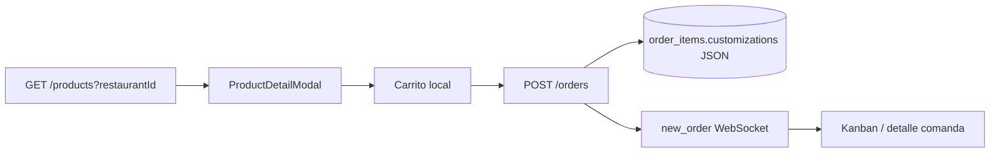

# Personalización por menú del restaurante

## Decisión de diseño (asumida)

- **Selección:** multi-selección opcional en Adiciones, Acompañamientos y Bebidas (0..N).
- **Modelo de pedido:** un ítem principal + extras anidados en `customizations` (no líneas separadas). El backend **recalcula** `extra_price` con los precios reales de esos productos; el cliente solo envía IDs.
- Las categorías ya existen en el catálogo: `Adiciones`, `Acompañamientos`, `Bebidas` ([`src/mocks/menuMock.ts`](c:\Users\yilgr\OneDrive\Desktop\diplomado-frontend\src\mocks\menuMock.ts)).



## UI cliente

Reescribir [`ProductDetailModal.tsx`](c:\Users\yilgr\OneDrive\Desktop\diplomado-frontend\src\components\cliente\ProductDetailModal.tsx):

- Tomar el menú del restaurante activo desde `useCliente().menu`.
- Filtrar disponibles por categoría y mismo `restaurantId` del plato:
  - **Elige tus adiciones** → `Adiciones`
  - **Elige tus acompañamientos** → `Acompañamientos`
  - **Elige tu bebida adicional** → `Bebidas`
- Cada opción muestra nombre + `+ $ precio`.
- Todas opcionales (sin mínimos).
- Textarea **Instrucciones especiales** (`placeholder`: `Ej. Sin cebolla / Sin azúcar`).
- Quitar el flujo actual de ingredientes/modifier_groups del producto (ya no alimenta este modal).
- Precio del botón = `basePrice + suma precios seleccionados`.

Actualizar tipos y mapeo:

- Extender `OrderItemCustomizations` en [`ordersMock.ts`](c:\Users\yilgr\OneDrive\Desktop\diplomado-frontend\src\mocks\ordersMock.ts).
- Payload en [`ClienteContext.confirmCart`](c:\Users\yilgr\OneDrive\Desktop\diplomado-frontend\src\context\ClienteContext.tsx) y [`clientOrders.ts`](c:\Users\yilgr\OneDrive\Desktop\diplomado-frontend\src\lib\api\endpoints\clientOrders.ts).
- Texto en carrito/comanda: [`orderCustomizations.ts`](c:\Users\yilgr\OneDrive\Desktop\diplomado-frontend\src\lib\orderCustomizations.ts) + mappers en [`mappers.ts`](c:\Users\yilgr\OneDrive\Desktop\diplomado-frontend\src\lib\api\admin\mappers.ts).

## Contrato recomendado — `POST /orders`

Body de cada ítem (snake_case):

```json
{
  "product_id": "uuid-plato-principal",
  "quantity": 1,
  "customizations": {
    "addition_ids": ["uuid-adicion"],
    "side_ids": ["uuid-acomp"],
    "drink_ids": ["uuid-bebida"],
    "special_instructions": "Sin cebolla",
    "extra_price": 8500
  }
}
```

Reglas backend en `CreateOrderUseCase`:

1. Validar que cada ID exista, esté `available` y pertenezca al mismo `restaurant_id`.
2. Validar categoría esperada (Adiciones / Acompañamientos / Bebidas).
3. **Ignorar** el `extra_price` del cliente y recalcular: suma de precios de esos productos.
4. `unit_price` del ítem = precio del plato + `extra_price`.
5. Persistir el JSON enriquecido (IDs + nombres + precios) en `order_items.customizations` para cocina/admin.

Compatibilidad: mantener lectura de `removed_ingredients` / `added_modifiers` en el serializer por pedidos viejos; nuevos pedidos usan el shape anterior.

## Endpoints a actualizar (backend)

| Endpoint | Cambio |
|----------|--------|
| `POST /orders` | Schema Zod + use case de validación/reprecio |
| Serializer de orden (`serializeOrderItem`) | Exponer nuevo shape en respuestas |
| `GET /orders/track/:code` | Misma serialización |
| `GET /orders/restaurant/:id` | Misma serialización (Kanban/detalle) |
| WebSocket `new_order` / `order_status_changed` | Usa el mismo serializer (sin ruta extra) |
| `GET /products?restaurantId=` | Sin cambio de contrato; el cliente filtra por `category_name` |

No hace falta endpoint nuevo de “extras”: salen del catálogo ya cargado.

Admin: el modal de “Personalizar receta” (ingredients/modifiers por producto) deja de ser la fuente de adiciones/bebidas/acompañamientos para el cliente; esas se gestionan como productos de menú (Adiciones / Acompañamientos / Bebidas). Se puede dejar el modal admin para otros usos o deprecarlo después.

## Archivos clave

**Frontend:** `ProductDetailModal.tsx`, `ClienteContext.tsx`, `clientOrders.ts`, `orderCustomizations.ts`, `ordersMock.ts`, `mappers.ts`

**Backend:** [`schemas.ts`](c:\Users\yilgr\OneDrive\Desktop\diplomado-backend\src\adapters\http\dto\schemas.ts) (`orderCustomizationSchema`), [`OrderUseCases.ts`](c:\Users\yilgr\OneDrive\Desktop\diplomado-backend\src\application\use-cases\orders\OrderUseCases.ts), [`orderSerializer.ts`](c:\Users\yilgr\OneDrive\Desktop\diplomado-backend\src\adapters\http\serializers\orderSerializer.ts), docs [`API-CLIENTE-FLUJO-MINIMO.md`](c:\Users\yilgr\OneDrive\Desktop\diplomado-backend\docs\API-CLIENTE-FLUJO-MINIMO.md)

## Orden de implementación

1. Tipos + modal cliente + carrito/payload.
2. Schema + use case + serializer backend.
3. Ajuste de visualización admin/tracking.
4. Probar E2E: plato + adición + acompañamiento + bebida + nota → Kanban.