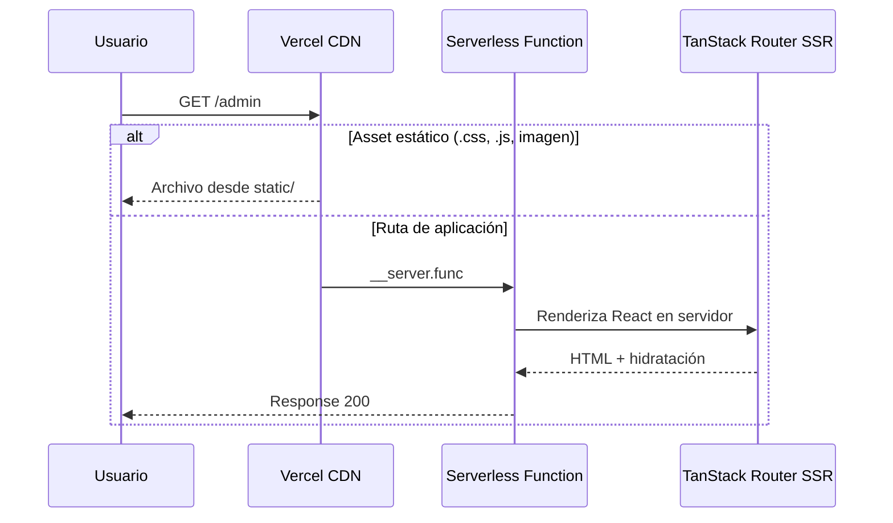
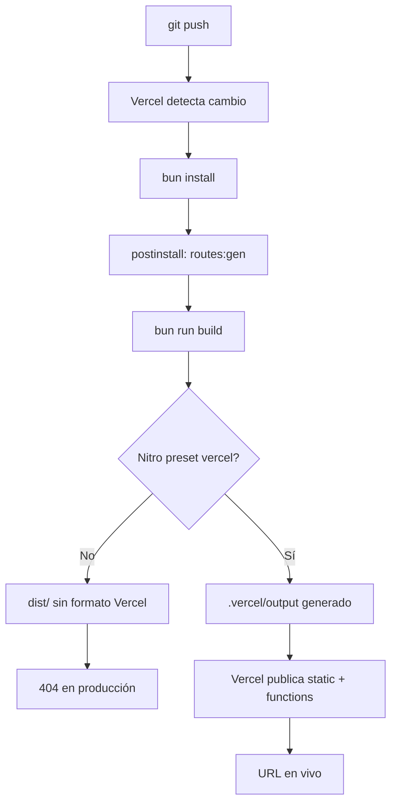

# Guía completa de despliegue en Vercel — FFCore / diplomado-frontend

Documento de estudio sobre qué es Vercel, cómo funciona el despliegue de esta aplicación, qué se necesita para que opere correctamente y cómo diagnosticar problemas.

---

## Tabla de contenidos

1. [¿Qué es Vercel?](#1-qué-es-vercel)
2. [Conceptos clave para entender el despliegue](#2-conceptos-clave-para-entender-el-despliegue)
3. [Stack de este proyecto](#3-stack-de-este-proyecto)
4. [¿Por qué no es un deploy “normal” de React?](#4-por-qué-no-es-un-deploy-normal-de-react)
5. [Arquitectura del despliegue](#5-arquitectura-del-despliegue)
6. [Flujo completo: del código a producción](#6-flujo-completo-del-código-a-producción)
7. [Configuración aplicada en este repositorio](#7-configuración-aplicada-en-este-repositorio)
8. [Estructura de salida del build (`.vercel/output`)](#8-estructura-de-salida-del-build-verceloutput)
9. [Requisitos para que el despliegue funcione al 100%](#9-requisitos-para-que-el-despliegue-funcione-al-100)
10. [Pasos para desplegar (primera vez y actualizaciones)](#10-pasos-para-desplegar-primera-vez-y-actualizaciones)
11. [Variables de entorno](#11-variables-de-entorno)
12. [El error 404 que tuvimos y cómo se corrigió](#12-el-error-404-que-tuvimos-y-cómo-se-corrigió)
13. [Diagnóstico y troubleshooting](#13-diagnóstico-y-troubleshooting)
14. [Comparativa: tipos de aplicaciones en Vercel](#14-comparativa-tipos-de-aplicaciones-en-vercel)
15. [Glosario](#15-glosario)
16. [Preguntas de repaso (guía de estudio)](#16-preguntas-de-repaso-guía-de-estudio)
17. [Referencias oficiales](#17-referencias-oficiales)

---

## 1. ¿Qué es Vercel?

**Vercel** es una plataforma en la nube (**PaaS** — Platform as a Service) especializada en desplegar aplicaciones web frontend y full-stack con el mínimo de configuración posible.

### ¿Qué hace Vercel por ti?

| Función | Descripción |
|---------|-------------|
| **Hosting** | Sirve tu aplicación en una URL pública (`*.vercel.app` o dominio propio). |
| **CI/CD automático** | Conecta tu repositorio Git; cada `push` puede generar un nuevo deploy. |
| **CDN global** | Distribuye archivos estáticos (CSS, JS, imágenes) desde servidores cercanos al usuario. |
| **Serverless Functions** | Ejecuta código en el servidor solo cuando llega una petición (sin mantener un servidor 24/7). |
| **Preview deployments** | Cada rama o PR puede tener su propia URL de prueba. |
| **HTTPS** | Certificados SSL automáticos. |

### Modelo mental

Piensa en Vercel como un **intermediario inteligente** entre tu repositorio Git y los usuarios:

```
Desarrollador → Git (GitHub/GitLab/Bitbucket) → Vercel build → Internet → Usuario
```

Tú no administras servidores, nginx ni certificados manualmente. Vercel los gestiona según la **configuración de build** y el **formato de salida** que le entregues.

### Planes y límites (concepto general)

- **Hobby**: gratuito para proyectos personales; límites en ancho de banda y tiempo de funciones.
- **Pro / Enterprise**: más recursos, equipos, soporte.

Para este proyecto académico/diplomado, el plan Hobby suele ser suficiente.

---

## 2. Conceptos clave para entender el despliegue

### 2.1 Build (compilación)

Proceso que transforma el código fuente (`src/`, TypeScript, React) en archivos listos para producción. En este proyecto:

```bash
bun run build   # ejecuta: vite build
```

### 2.2 Output Directory (directorio de salida)

Carpeta que Vercel busca **después del build** para saber qué publicar.  
**Es el punto más crítico** en proyectos SSR como el nuestro.

| Proyecto | Output típico |
|----------|----------------|
| React + Vite (SPA estática) | `dist/` con `index.html` |
| Next.js | `.next/` (Vercel lo detecta solo) |
| **TanStack Start + Nitro (este proyecto)** | **`.vercel/output/`** |

### 2.3 SSR — Server-Side Rendering

El HTML se genera **en el servidor** en cada petición (o en build time con prerender).  
Ventajas: mejor SEO, primera carga más rápida, rutas dinámicas sin configurar rewrites manuales.

Este proyecto usa SSR a través de **TanStack Start**.

### 2.4 SPA — Single Page Application

Un solo `index.html`; el router del cliente (JavaScript) maneja las rutas (`/admin`, `/cliente`).  
Vercel puede servirla con rewrites a `index.html`. **Este proyecto NO es una SPA pura.**

### 2.5 Serverless Functions (Vercel Functions)

Bloques de código que Vercel ejecuta en Node.js (u otro runtime) cuando un usuario visita una ruta que requiere lógica de servidor.  
En nuestro caso, Nitro genera `functions/__server.func/` que maneja **todas las rutas SSR**.

### 2.6 Nitro

**Motor de despliegue universal** del ecosistema TanStack/UnJS. Toma el build de Vite y lo empaqueta en el formato que cada plataforma entiende:

| Preset | Destino |
|--------|---------|
| `cloudflare` | Cloudflare Workers (default en Lovable) |
| `vercel` | Vercel Build Output API |
| `node-server` | Servidor Node tradicional |

Sin `preset: "vercel"`, Nitro no genera lo que Vercel necesita.

### 2.7 Build Output API

Formato estándar de Vercel (v3) donde la carpeta `.vercel/output/` contiene:

- `config.json` — reglas de enrutamiento
- `static/` — assets estáticos (CDN)
- `functions/` — código serverless

### 2.8 Fluid Compute

Modelo de ejecución de Vercel donde las funciones escalan automáticamente según tráfico. TanStack Start en Vercel lo usa por defecto.

---

## 3. Stack de este proyecto

```
┌─────────────────────────────────────────────────────────┐
│                    diplomado-frontend                    │
│                      (FFCore)                        │
├─────────────────────────────────────────────────────────┤
│  React 19          → UI y componentes                   │
│  TanStack Router   → Enrutamiento (src/routes/)         │
│  TanStack Start    → SSR, server functions, bundling    │
│  TanStack Query    → Estado remoto / caché              │
│  Vite 8            → Bundler y dev server               │
│  Tailwind CSS 4    → Estilos                            │
│  Nitro             → Adaptador de despliegue            │
│  Lovable config    → @lovable.dev/vite-tanstack-config  │
│  Bun               → Gestor de paquetes (bun.lock)      │
└─────────────────────────────────────────────────────────┘
```

### Estructura relevante del repositorio

```
diplomado-frontend/
├── src/
│   ├── routes/           # Páginas: admin, cliente, domiciliario, superadmin
│   ├── server.ts         # Entry del servidor SSR (wrapper de errores)
│   ├── start.ts          # Configuración TanStack Start
│   ├── router.tsx        # Router principal
│   └── context/          # AuthContext, OrderContext
├── vite.config.ts        # Build + Nitro preset vercel
├── vercel.json           # Configuración de deploy en Vercel
├── package.json          # Scripts: dev, build, routes:gen
├── tsr.config.json       # Generación de rutas TanStack Router
└── docs/
    └── DEPLOY-VERCEL.md  # Este documento
```

### Rutas de la aplicación

| Ruta | Rol |
|------|-----|
| `/` | Página principal / login |
| `/admin` | Panel administrador |
| `/cliente` | App cliente |
| `/domiciliario` | App domiciliario |
| `/superadmin` | Super administrador |

Todas requieren que el **servidor SSR** responda correctamente en producción.

---

## 4. ¿Por qué no es un deploy “normal” de React?

Muchos tutoriales enseñan:

> “Sube tu proyecto Vite a Vercel, Output Directory = `dist`”

Eso funciona **solo** si tienes un `index.html` en `dist/` y routing 100% en el cliente.

### Este proyecto es diferente porque:

1. **No hay `index.html` en la raíz del repo** — TanStack Start lo genera en tiempo de build.
2. **Usa SSR** — cada ruta puede renderizarse en el servidor.
3. **Tiene entry de servidor** — `src/server.ts` envuelve el handler de TanStack Start.
4. **Lovable desactiva Nitro fuera de su entorno** — sin configuración explícita, el build no produce `.vercel/output/`.
5. **El preset por defecto es Cloudflare**, no Vercel.

### Build SIN configuración Nitro (incorrecto para Vercel)

```
vite build
    ↓
dist/client/assets/   ← solo JS y CSS
dist/server/          ← código servidor sin empaquetar para Vercel
    ↓
Vercel busca archivos estáticos o .vercel/output
    ↓
404: NOT_FOUND
```

### Build CON configuración Nitro (correcto)

```
vite build + nitro preset vercel
    ↓
.vercel/output/
    ├── static/          ← CDN
    ├── functions/       ← SSR serverless
    └── config.json      ← routing
    ↓
Vercel despliega correctamente
```

---

## 5. Arquitectura del despliegue

### Diagrama: petición del usuario en producción



### Diagrama: pipeline de CI/CD



---

## 6. Flujo completo: del código a producción

### Fase 1 — Desarrollo local

```bash
bun install          # instala dependencias
bun run dev          # servidor de desarrollo Vite
```

- `postinstall` ejecuta `bun run routes:gen` → genera `src/routeTree.gen.ts`.
- Editas componentes en `src/`.
- Las rutas viven en `src/routes/*.tsx`.

### Fase 2 — Build de producción

```bash
bun run build
```

**Qué ocurre internamente:**

1. **Vite (client)** — empaqueta JS/CSS del cliente → `.vercel/output/static/`.
2. **Vite (SSR)** — empaqueta módulos del servidor.
3. **Nitro** — con `preset: "vercel"`:
   - Crea la función `__server.func`.
   - Genera `config.json` con reglas de routing.
   - Escribe `nitro.json` con metadatos del build.
4. Mensaje esperado en consola:
   ```
   [nitro:vercel] i Using nodejs22.x runtime.
   [nitro:vercel] i Using node entry format.
   i Generated .vercel/output/nitro.json
   ```

### Fase 3 — Deploy en Vercel

1. Vercel clona el repo.
2. Ejecuta `bun install` (definido en `vercel.json`).
3. Ejecuta `bun run build`.
4. Lee `.vercel/output/` como artefacto final.
5. Distribuye `static/` en CDN y registra `functions/` como serverless.
6. Asigna URL: `https://tu-proyecto.vercel.app`.

### Fase 4 — Usuario visita la app

1. Navegador pide `https://tu-proyecto.vercel.app/cliente`.
2. Vercel enruta a la función serverless (no busca un archivo físico `cliente/index.html`).
3. La función ejecuta TanStack Start → renderiza React → devuelve HTML.
4. El navegador descarga JS de `static/assets/` y **hidrata** la app (React toma control en el cliente).

---

## 7. Configuración aplicada en este repositorio

### 7.1 `vite.config.ts`

```ts
import { defineConfig } from "@lovable.dev/vite-tanstack-config";

export default defineConfig({
  tanstackStart: {
    // Entry personalizado con manejo de errores SSR
    server: { entry: "server" },
  },
  nitro: {
    preset: "vercel",
    vercel: {
      entryFormat: "node",
    },
  },
});
```

| Opción | Propósito |
|--------|-----------|
| `tanstackStart.server.entry: "server"` | Usa `src/server.ts` como punto de entrada del servidor. |
| `nitro.preset: "vercel"` | Genera salida compatible con Vercel Build Output API. |
| `nitro.vercel.entryFormat: "node"` | Usa handler Node.js; evita bugs SSR con el handler Web de Nitro. |

> **Importante:** No agregues manualmente `tanstackStart()`, `viteReact()`, `nitro()` en `plugins` — `@lovable.dev/vite-tanstack-config` ya los incluye. Duplicarlos rompe el build.

### 7.2 `vercel.json`

```json
{
  "$schema": "https://openapi.vercel.sh/vercel.json",
  "buildCommand": "bun run build",
  "installCommand": "bun install",
  "outputDirectory": ".vercel/output",
  "framework": null
}
```

| Campo | Valor | Explicación |
|-------|-------|-------------|
| `buildCommand` | `bun run build` | Comando que produce el artefacto de producción. |
| `installCommand` | `bun install` | Instala dependencias con Bun (coherente con `bun.lock`). |
| `outputDirectory` | `.vercel/output` | Carpeta que Nitro genera; **no** `dist`. |
| `framework` | `null` | Evita autodetección incorrecta como “Vite SPA”. |

**Alternativa con npm** (si Vercel no tiene Bun):

```json
{
  "buildCommand": "npm run build",
  "installCommand": "npm install",
  "outputDirectory": ".vercel/output",
  "framework": null
}
```

### 7.3 `.gitignore`

```
.vercel
dist
.output
```

La carpeta `.vercel/output` se genera en build; no debe versionarse en Git.

### 7.4 `package.json` — scripts relevantes

| Script | Comando | Cuándo se ejecuta |
|--------|---------|-------------------|
| `dev` | `vite dev` | Desarrollo local |
| `build` | `vite build` | Producción / Vercel |
| `routes:gen` | `tsr generate` | Genera árbol de rutas |
| `postinstall` | `bun run routes:gen` | Después de cada `install` en Vercel |

El `postinstall` es crítico: sin `routeTree.gen.ts`, el build puede fallar en CI.

---

## 8. Estructura de salida del build (`.vercel/output`)

Después de `bun run build`, verifica:

```powershell
# Windows PowerShell
Get-ChildItem .vercel/output -Recurse -Depth 2
```

Estructura esperada:

```
.vercel/output/
├── config.json              # Reglas de enrutamiento para Vercel
├── nitro.json               # Metadatos del build Nitro
├── static/
│   └── assets/
│       ├── styles-*.css
│       ├── index-*.js
│       ├── admin-*.js
│       └── ...
└── functions/
    └── __server.func/
        ├── index.mjs        # Handler principal SSR
        ├── .vc-config.json  # Config de la función (runtime Node)
        └── _libs/           # Dependencias empaquetadas
```

### Rol de cada parte

| Carpeta/archivo | Rol |
|-----------------|-----|
| `static/` | Archivos cacheables en CDN (CSS, JS del cliente, fuentes). |
| `functions/__server.func/` | Función que renderiza HTML para rutas de la app. |
| `config.json` | Le dice a Vercel qué va a CDN y qué va a la función. |

---

## 9. Requisitos para que el despliegue funcione al 100%

### 9.1 Requisitos de código y configuración

| # | Requisito | Estado en el repo |
|---|-----------|-------------------|
| 1 | `nitro` en `package.json` | ✅ `nitro@3.0.260603-beta` |
| 2 | `preset: "vercel"` en `vite.config.ts` | ✅ Configurado |
| 3 | `vercel.json` con `outputDirectory` correcto | ✅ `.vercel/output` |
| 4 | `postinstall` genera rutas | ✅ `bun run routes:gen` |
| 5 | Entry de servidor (`src/server.ts`) | ✅ Presente |

### 9.2 Requisitos en Vercel (panel)

| Setting | Valor recomendado |
|---------|-------------------|
| **Root Directory** | `.` (raíz; cambiar solo si es monorepo) |
| **Framework Preset** | Other |
| **Build Command** | `bun run build` |
| **Output Directory** | `.vercel/output` |
| **Install Command** | `bun install` |
| **Node.js Version** | 22.x (Nitro usa `nodejs22.x` por defecto) |

### 9.3 Requisitos de Git

- Repositorio conectado a Vercel (GitHub/GitLab/Bitbucket).
- Rama de producción definida (ej. `main`, `develop`).
- Commits incluyen `vite.config.ts` y `vercel.json`.

### 9.4 Requisitos de verificación local

Antes de cada deploy importante:

```bash
bun run build
```

Comprobar:

- [ ] Existe `.vercel/output/config.json`
- [ ] Existe `.vercel/output/functions/__server.func/index.mjs`
- [ ] Existe `.vercel/output/static/assets/`
- [ ] No aparece `skipping nitro deploy plugin` en los logs

### 9.5 Opcional: variables de entorno

Actualmente el proyecto **no usa** `VITE_*` en el código. Si en el futuro conectas API, Supabase, etc.:

```
Vercel → Project → Settings → Environment Variables
```

Añade las variables para **Production**, **Preview** y **Development** según corresponda.

### 9.6 Opcional: dominio personalizado

```
Vercel → Project → Settings → Domains → Add
```

Configura DNS (CNAME o A record) según indique Vercel.

---

## 10. Pasos para desplegar (primera vez y actualizaciones)

### Primera vez

1. **Cuenta Vercel** — [vercel.com](https://vercel.com) con GitHub/GitLab.
2. **New Project** → Importar repositorio `diplomado-frontend`.
3. **Configuración** — Vercel leerá `vercel.json`; confirma valores.
4. **Deploy** — espera a que termine el build.
5. **Probar URL** — visita `/`, `/admin`, `/cliente`.
6. Si falla → ver [sección 13](#13-diagnóstico-y-troubleshooting).

### Actualizaciones (flujo habitual)

```bash
git add .
git commit -m "feat: descripción del cambio"
git push origin develop   # o la rama conectada
```

Vercel detecta el push y despliega automáticamente.

### Redeploy sin caché (cuando algo “no cuadra”)

```
Vercel Dashboard → Deployments → ⋯ → Redeploy → Redeploy without Build Cache
```

Útil después de cambiar `vite.config.ts`, `vercel.json` o dependencias.

### Deploy manual con CLI (opcional)

```bash
npm i -g vercel
vercel login
vercel          # preview
vercel --prod   # producción
```

---

## 11. Variables de entorno

### Cómo funcionan en Vite

Solo las variables con prefijo `VITE_` se exponen al cliente:

```ts
const apiUrl = import.meta.env.VITE_API_URL;
```

### Dónde configurarlas en Vercel

| Entorno | Uso |
|---------|-----|
| **Production** | URL principal en vivo |
| **Preview** | Deploys de ramas y PRs |
| **Development** | `vercel dev` local |

### Buenas prácticas

- Nunca commitear `.env` con secretos.
- Usar nombres descriptivos: `VITE_API_URL`, `VITE_SUPABASE_ANON_KEY`.
- Tras añadir variables → **redeploy obligatorio**.

---

## 12. El error 404 que tuvimos y cómo se corrigió

### Síntoma

```
404: NOT_FOUND
Code: 'NOT_FOUND'
```

Al hacer `GET /` en la URL de Vercel.

### Causa raíz

| Factor | Detalle |
|--------|---------|
| Tipo de app | SSR (TanStack Start), no SPA estática |
| Build sin Nitro Vercel | Solo `dist/client` + `dist/server` |
| Sin `index.html` en output | Vercel no tenía qué servir en `/` |
| Preset Lovable | Cloudflare por defecto; Nitro desactivado fuera de Lovable |

### Log que delataba el problema

```
No Lovable context detected — skipping nitro deploy plugin.
Pass `nitro: true` (or `nitro: { ... }`) to force-enable.
```

### Solución aplicada

1. `nitro: { preset: "vercel" }` en `vite.config.ts`.
2. `vercel.json` apuntando a `.vercel/output`.
3. `entryFormat: "node"` para estabilidad SSR.
4. Redeploy sin caché.

### Cómo distinguir 404 de Vercel vs 404 de la app

| Tipo | Aspecto | Origen |
|------|---------|--------|
| **Vercel 404** | Página minimalista gris, `Code: 'NOT_FOUND'`, ID de deployment | Infraestructura: no encuentra archivos/funciones |
| **App 404** | Diseño de la app (TanStack `NotFoundComponent`) | La app corre; la ruta no existe en el router |

---

## 13. Diagnóstico y troubleshooting

### Checklist rápido

```
□ ¿El build local genera .vercel/output?
□ ¿vercel.json tiene outputDirectory: ".vercel/output"?
□ ¿vite.config.ts tiene nitro.preset: "vercel"?
□ ¿El panel de Vercel coincide con vercel.json?
□ ¿Redeploy sin caché después de cambios de config?
□ ¿postinstall (routes:gen) corre sin error?
```

### Errores frecuentes

| Error | Causa probable | Solución |
|-------|----------------|----------|
| `404: NOT_FOUND` en `/` | Output incorrecto o Nitro desactivado | Activar preset vercel; output `.vercel/output` |
| `No Output Directory named "dist"` | Panel apunta a `dist` | Cambiar a `.vercel/output` |
| Build OK pero pantalla blanca | JS no carga o error en runtime | Revisar consola del navegador y logs de función |
| `routeTree.gen.ts` no encontrado | `postinstall` falló | Verificar `bun run routes:gen` en install |
| Plugins duplicados | Agregar plugins manualmente en vite | Usar solo `defineConfig` de Lovable |
| Bun no disponible en Vercel | Install falla | Cambiar a `npm install` en `vercel.json` |
| SSR crash en producción | Handler web de Nitro | Usar `entryFormat: "node"` |

### Comandos útiles de diagnóstico

```bash
# Build local completo
bun run build

# Ver estructura de salida
ls .vercel/output

# Preview local del build Nitro (opcional)
npx vite preview
```

### Dónde mirar logs

| Lugar | Qué buscar |
|-------|------------|
| **Vercel → Build Logs** | Errores en install, build, Nitro |
| **Vercel → Function Logs** | Errores SSR en runtime |
| **Consola del navegador** | Errores JS del cliente |
| **Network tab** | Status 404 en `/` o en assets |

---

## 14. Comparativa: tipos de aplicaciones en Vercel

| Característica | SPA (Vite/React) | Next.js | **Este proyecto (TanStack Start)** |
|----------------|------------------|---------|----------------------------------|
| `index.html` en build | Sí, en `dist/` | No (app router) | No (SSR genera HTML) |
| Output Directory | `dist` | Auto | `.vercel/output` |
| Servidor en producción | No | Sí (integrado) | Sí (via Nitro) |
| Adapter necesario | No (o rewrites) | No | **Sí (Nitro preset vercel)** |
| Routing en producción | Cliente o rewrites | Framework | SSR + función serverless |
| Config Lovable default | N/A | N/A | Cloudflare, no Vercel |

---

## 15. Glosario

| Término | Definición |
|---------|------------|
| **Build** | Compilar código fuente a artefactos de producción. |
| **CDN** | Red de servidores que entrega archivos estáticos rápido. |
| **CI/CD** | Integración y despliegue continuo automatizado. |
| **Deploy** | Publicar una versión de la app en un entorno accesible. |
| **Hidratación** | React “activa” el HTML estático del servidor en el cliente. |
| **Nitro** | Toolkit que empaqueta apps para distintas plataformas de hosting. |
| **Output Directory** | Carpeta que el hosting usa tras el build. |
| **Preset** | Configuración de destino de Nitro (vercel, cloudflare, etc.). |
| **PaaS** | Plataforma como servicio; no gestionas el servidor directamente. |
| **Preview Deployment** | URL temporal para una rama o PR. |
| **SSR** | Renderizado en el servidor antes de enviar HTML al navegador. |
| **Serverless** | Código que corre bajo demanda sin servidor siempre encendido. |
| **TanStack Start** | Framework full-stack sobre TanStack Router. |
| **Vercel Functions** | Funciones serverless hospedadas en Vercel. |

---

## 16. Preguntas de repaso (guía de estudio)

### Nivel básico

1. ¿Qué es Vercel y qué problema resuelve para un desarrollador frontend?
2. ¿Cuál es la diferencia entre `bun run dev` y `bun run build`?
3. ¿Por qué este proyecto no puede usar `dist/` como Output Directory?
4. ¿Qué archivo indica a Vercel dónde está la salida del build?

### Nivel intermedio

5. Explica la diferencia entre SPA y SSR con tus propias palabras.
6. ¿Qué hace Nitro y por qué necesitamos `preset: "vercel"`?
7. ¿Qué contiene la carpeta `.vercel/output/static/` vs `functions/`?
8. ¿Por qué `framework: null` en `vercel.json`?

### Nivel avanzado

9. Describe el flujo completo cuando un usuario visita `/admin`.
10. ¿Qué significa el mensaje `skipping nitro deploy plugin` y cómo se corrige?
11. ¿Por qué usamos `entryFormat: "node"` en la config de Nitro?
12. ¿Cómo diferenciarías un 404 de Vercel de un 404 de TanStack Router?

### Ejercicio práctico

1. Ejecuta `bun run build` localmente.
2. Lista el contenido de `.vercel/output`.
3. Identifica el archivo handler de la función serverless.
4. Cambia temporalmente `outputDirectory` a `dist` en `vercel.json`, predice qué pasaría en Vercel, y revierte el cambio.

---

## 17. Referencias oficiales

- [Vercel — Documentación general](https://vercel.com/docs)
- [TanStack Start on Vercel](https://vercel.com/docs/frameworks/full-stack/tanstack-start)
- [Deploy a TanStack Start app to Vercel (KB)](https://vercel.com/kb/guide/deploy-a-tanstack-start-app-to-vercel)
- [Vercel Build Output API](https://vercel.com/docs/build-output-api/v3)
- [TanStack Start — Documentación](https://tanstack.com/start/latest)
- [TanStack Router](https://tanstack.com/router/latest)
- [Nitro — Documentación](https://nitro.build/)
- [Vite — Documentación](https://vite.dev/)

---

## Resumen ejecutivo (una página)

| Pregunta | Respuesta |
|----------|-----------|
| **¿Qué es Vercel?** | Plataforma PaaS para hostear apps web con CI/CD, CDN y serverless. |
| **¿Qué es este proyecto?** | React 19 + TanStack Start (SSR) + Vite + Nitro, generado con Lovable. |
| **¿Cómo se despliega?** | Push a Git → Vercel ejecuta `bun install` + `bun run build` → publica `.vercel/output`. |
| **¿Qué lo hace funcionar?** | `nitro.preset: "vercel"` + `vercel.json` con output `.vercel/output`. |
| **¿Cuál era el bug 404?** | Build sin formato Vercel; solo `dist/` sin función serverless. |
| **¿Cómo verificar?** | `bun run build` → debe existir `.vercel/output/functions/`. |

---

*Última actualización: configuración aplicada en `vite.config.ts` y `vercel.json` del repositorio diplomado-frontend (FFCore).*
